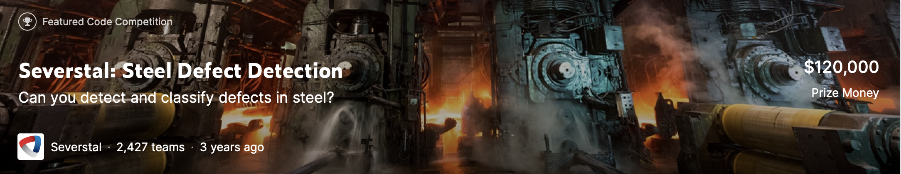

# Kaggle Severstal: Steel Defect Detection

[Kaggle page](https://www.kaggle.com/c/severstal-steel-defect-detection)

The production process of flat sheet steel is especially delicate. From heating and rolling, to drying and cutting, several machines touch flat steel by the time it’s ready to ship. Today, Severstal uses images from high frequency cameras to power a defect detection algorithm. In this competition, you’ll help engineers improve the algorithm by localizing and classifying surface defects on a steel sheet.

The solution is based on a combination of classification and segmentation model. The segmentation model uses U-net architecture. There are keras and pytorch realization of the models. The score on the leaderboard - Public LB 0.916 and Private LB 0.903.
